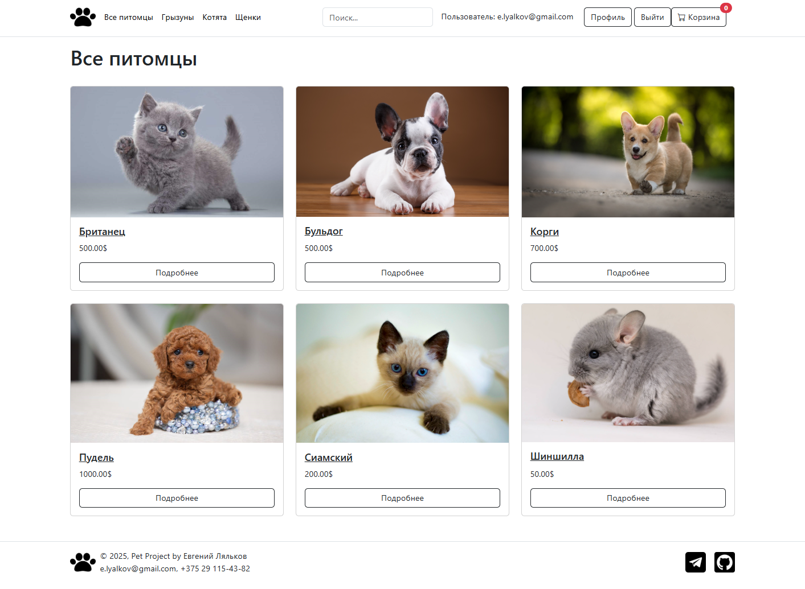
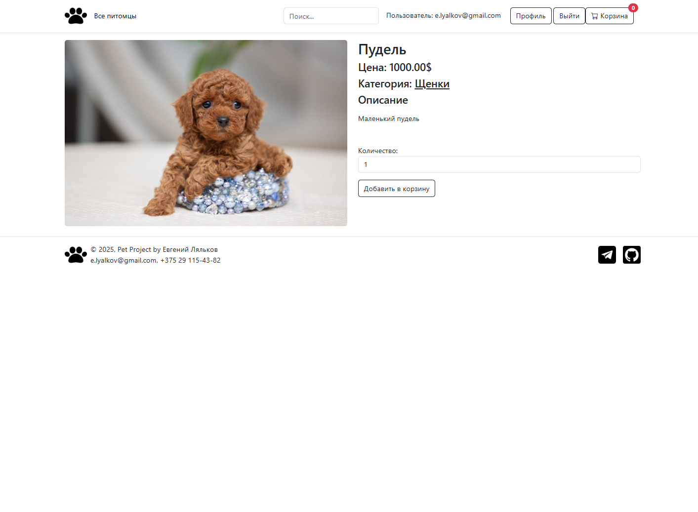
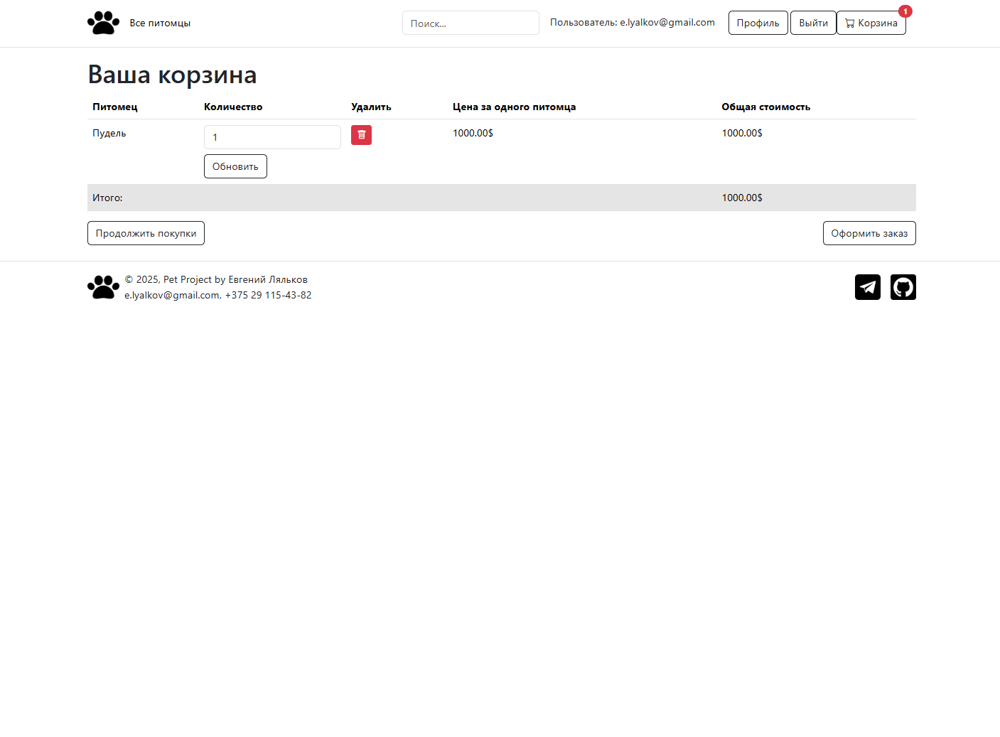
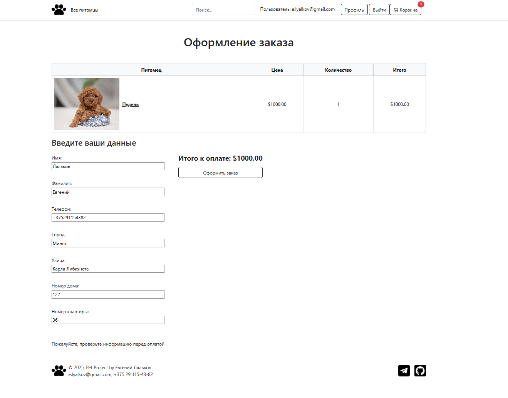

# E-shop Platform

Онлайн-магазин с системой заказов и управления товарами

## 📌 Основные возможности

### Для пользователей
- Просмотр товаров с фильтрацией по категориям
- Поиск товаров по названию
- Оформление и оплата заказов
- Личный кабинет с историей заказов

### Для администраторов
- Управление категориями и товарами (создание, обновление, редактирование, удаление)
- Просмотр полной информации о зарегистрированных пользователях
- Обновление статуса заказа

## 🛠 Технологический стек

| Компонент       | Технология                |
|-----------------|--------------------------|
| Backend         |   |
| Frontend        |   |
| База данных     |  |
| Дополнительные библиотеки |    |
| Тестирование    |  |


## 🚀 Установка и запуск

### 1. Клонирование репозитория и настройка директории
```bash
git clone https://github.com/elyalkov/my-pet-project-django.git
cd first_pet
```

### 2. Настройка виртуального окружения
```bash
python -m venv venv
source venv/bin/activate  # Linux/Mac
venv\Scripts\activate     # Windows
```

### 3. Установка зависимостей
```bash
pip install -r requirements.txt
```

### 4. Настройка переменных окружения
Создайте файл `.env` в корне проекта (директория first_pet) и скопируйте:
```ini
STRIPE_TEST_PUBLIC_KEY = pk_test_51RtlREIRPeO2wDgr3eeT4bt2zH8IZBB5AAYVU1wSXY4GVYSdOUytxSFrgYwVGl57IBo0M6nTDXw4P0Z9EDoM9b7N00Hv3pjuKe
STRIPE_TEST_SECRET_KEY = sk_test_51RtlREIRPeO2wDgrX3CUGCSYS3xjNlmxRAqqJx331Tl7xX0qxRWIICoiijVaudAz7cZjdSwGziXntiGjCGEbOzJ8005RlHGVCU
```

### 5. Запуск сервера разработки
```bash
python manage.py runserver
```

### 6. Доступ в админ-панель
```bash
http://localhost:8000/admin/
```
- Логин: admin@admin.com
- Пароль: adminadmin

### 7. Настройка базы данных
Тестовая БД добавлена в репозиторий, если необходимо создать новую БД:
- Удалите загруженную БД
```bash
del db.sqlite3
```
- Создайте и примените миграции
```bash
python manage.py makemigrations
python manage.py migrate
```
- Создайте суперпользователя
```bash
python manage.py createsuperuser
```

### 8. Запуск unit-тестов
```bash
pytest -v
```

## 🧩 Структура проекта

```
first_pet/
├── cart/                        # Приложение "Корзина покупок" 
│   ├── migrations/              # Миграции базы данных
│   ├── templates/               # HTML шаблоны
│   ├── tests/                   # Тесты
│   ├── admin.py                 # Настройки админ-панели
│   ├── apps.py                  # Конфигурация приложения
│   ├── cart.py                  # Логика работы корзины
│   ├── context_processors.py    # Глобальные переменные для шаблонов
│   ├── forms.py                 # Формы
│   ├── models.py                # Модели данных
│   ├── tests.py                 # Тесты
│   ├── urls.py                  # URL-маршруты
│   └── views.py                 # Представления
├── first_pet/                   # Основная директория проекта
│   ├── asgi.py                  # ASGI конфигурация
│   ├── settings.py              # Основные настройки проекта
│   ├── urls.py                  # Главные URL-маршруты
│   └── wsgi.py                  # WSGI конфигурация
├── main/                        # Приложение "Главная страница"
│   ├── migrations/              # Миграции базы данных
│   ├── static/                  # Статические файлы
│   ├── templates/               # HTML шаблоны
│   ├── tests/                   # Тесты
│   ├── admin.py                 # Настройки админ-панели
│   ├── apps.py                  # Конфигурация приложения
│   ├── models.py                # Модели данных
│   ├── tests.py                 # Тесты
│   ├── urls.py                  # URL-маршруты
│   └── views.py                 # Представления
├── media/                       # Загружаемые файлы
├── orders/                      # Приложение "Заказы"
│   ├── migrations/              # Миграции базы данных
│   ├── templates/               # HTML шаблоны
│   ├── tests/                   # Тесты
│   ├── admin.py                 # Настройки админ-панели
│   ├── apps.py                  # Конфигурация приложения
│   ├── forms.py                 # Формы
│   ├── models.py                # Модели данных
│   ├── tests.py                 # Тесты
│   ├── urls.py                  # URL-маршруты
│   └── views.py                 # Представления
├── users/                       # Приложение "Пользователи"
│   ├── migrations/              # Миграции базы данных
│   ├── templates/               # HTML шаблоны
│   ├── tests/                   # Тесты
│   ├── admin.py                 # Настройки админ-панели
│   ├── apps.py                  # Конфигурация приложения
│   ├── forms.py                 # Формы
│   ├── models.py                # Модели данных
│   ├── tests.py                 # Тесты
│   ├── urls.py                  # URL-маршруты
│   └── views.py                 # Представления
├── .env                         # Переменные окружения
├── db.sqlite3                   # База данных SQLite
├── manage.py                    # Управляющий скрипт Django
├── pytest.ini                   # Конфигурация для тестов
└── requirements.txt             # Зависимости проекта
```

## 📷 Скриншоты проекта

### Главная страница
  
*Описание: Главная страница сайта с категориями и карточками товаров*

### Карточка товара
  
*Описание: Детальная информация о товаре*

### Корзина заказов
  
*Описание: Корзина заказа товаров*

### Оформление заказов
  
*Описание: Страница оформления заказов*

### Личный кабинет
  
*Описание: Личный кабинет с историей заказов и данными пользователя*

### Страница заказанного товара через админ-панель
 
*Описание: Просмотр информации о заказчике товара*
